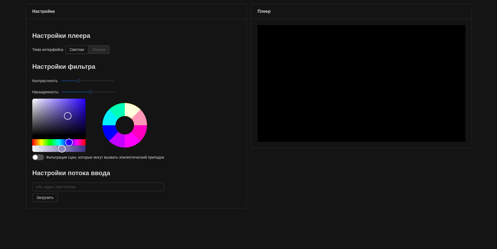
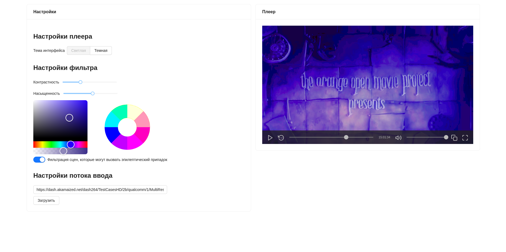
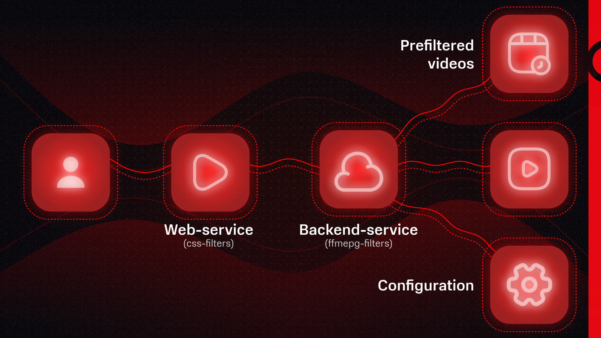

# Colorblinder filterer
Сервис фильтрации mpeg-dash стримов и VoD контента для людей с особенностями зрения. [Демо сервиса](http://colorblinder.beldmian.ru/)

## Description
Данный сервис предоставляет возможность фильтрации и подготовки видео для людей с особенностями зрения. Это достигается засчет двух типов фильтрации - цветовой фильтр и фильтр триггеров эпилепсии:
   - Цветовой фильтр работает на стороне клиента и представляет собой применение настраиваемых svg/css фильтров
   - Фильтр триггеров эпилепсии работает на стороне сервера и представляет собой фильтр ffmpeg, работающий в live-режиме.

## Usage

### Startup
Для запуска приложения доступно несколько вариантов

#### Docker (рекомендуемое)
Запускаем приложение через `docker compose up --build`, получаем запущенные backend, frontend и prometheus сервисы

#### Binary
Собираем приложение через `make build`, затем запускаем бинарник `./main`,
получаем запущенный backend-сервис на порте, указанном в `config.yaml` файле

#### Kubernetes
Разворачиввем в кластере kubernetes конфиги из директории `deploy/kubernetes` (например через команду `kubectl apply -f ./deploy/kubernetes`),
предварительно собрав backend-сервис в docker image с тегом `colorblinder/backend` и загрузив его в доступный для kubernetes docker registry.
Получаем запущенные backend-сервис и мониторинг с предустановленым дашбордом в grafana (сервис backend доступен по 80 порту на Ingress, grafana на 32000 порту). Предполагается, что данный способ развертки мог бы быть использован в текущей архитектуре KION, поскольку backend-сервис представляет собой уже готовый к работе middleware-сервис, а frontend так или иначе просто является представлением возможных модификаций в уже существующий.

### Backend API scheme

- `POST /start_stream` - Запускает стрим с фильтрацией контента, который может быть триггером эпилепсии
   - Request
   ```json
   {
      "stream_url": "https://dash.akamaized.net/dash264/TestCasesHD/2b/qualcomm/1/MultiResMPEG2.mpd"
   }
   ```
   - Response
   ```json
   {
      "new_url": "/stream/b1642bb4-e7fd-42ac-93dd-9334b4b74e35/file.mpd"
   }
   ```
- `GET /stream*` - Файловый сервер, дающий доступ к манифестам и фрагментам видео, которые перекодируются в живом режиме

### Frontend




По-умолчанию (при развертке в docker) frontend-сервис запускается на `127.0.0.1:80`, и представляет собой одностраничное веб-приложение
с возможностью цветовой фильтрации и обращения к backend-сервису для вызова фильтрации контента-триггера.
Использование:
- Пользователь, ориентируясь на цветовой круг, выставляет фильтры цветового спектра, контрастности и насыщенности так, чтобы отчетливо различать все цвета
- Затем, если требуется, пользователь включает фильтрацию сцен, которые могут быть триггерами эпилепсии
- Далее пользователем вписывается url-адрес mpf-манифеста желаемого видеоролика (в дальнейшем этот шаг должен быть скрыт через привязку к видеохостингу)
- После нажатия на кнопку "Загрузить" видеопоток начинает воспроизводиться в плеере сервиса, в реальном времени может быть изменена настройка цветовых фильтров 

### Prefilter video
В `Makefile` приведена команда (`make encode`), позволяющаяя заранее произвести фильтрацию контента, который может быть
тригерром эпилепсии, в видеоролике и преобразование его в mpeg dash формат.
Это сделано для экономии ресурсов серверов, если фильм/сериал/другой тип контента является очень популярным и постоянно запрашивается пользователями

## Architecture
